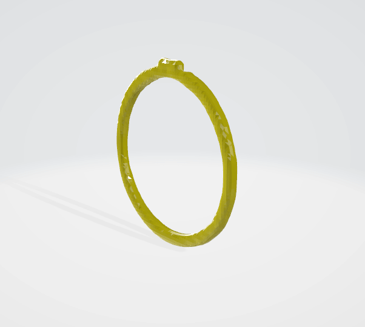
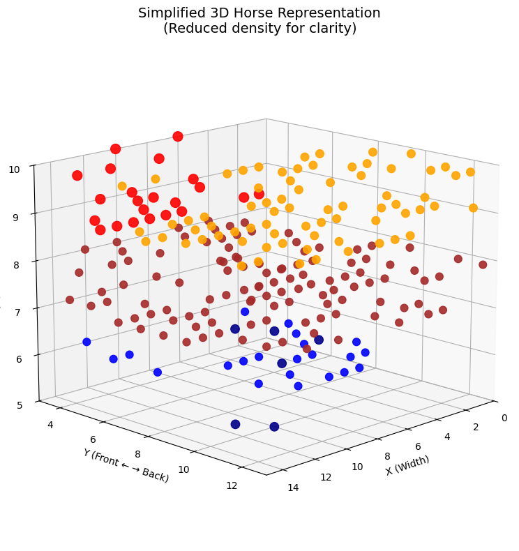

# WAVELET LATENT DIFFUSION (WALA) Optimization
[](https://arxiv.org/pdf/2411.08017)

## Overview

Welcome to the Optimized WaLa Repository!  
This repository provides an enhanced version of WaLa for fast and efficient 3D generative modeling, supporting ONNX export and TensorRT acceleration.

## Features

- **ONNX Exporter:** Export WaLa models for cross-platform inference using a command-line interface.
- **TensorRT Conversion:** Accelerate inference on NVIDIA hardware via an easy-to-use conversion script.
- **Inference Runner:** Run optimized TensorRT inference with full argparse support.
- **Multi-Modality Support:** Operates with several modalities including single-view, multiview, pointcloud, and voxels.

## Performance

Significant speedups are achieved with ONNX and TensorRT optimizations:

| Model Variant           | Latency (s) | Throughput (items/s) |
|-------------------------|-------------|----------------------|
| WaLa                    |     5.52    |         0.18         |
| WaLa + Fast Write       |     4.17    |         0.24         |
| WaLa + ONNX + TensorRT  |     0.75    |         1.33         |

*Benchmarks are provided for multiple modalities, including single-view and sketch-to-3D inference.*

## Quality Comparison

Model accuracy remains high after optimization:

| Model                | Metric | Result  |
|----------------------|--------|---------|
| WaLa                 | IoU    | 0.608   |
| WaLa + TensorRT      | IoU    | 0.5981  |
| WaLa                 | LfD    | 2435    |
| WaLa + TensorRT      | LfD    | 2466    |

## Visual Quality Comparison

Below are visual comparisons of 3D objects generated by the original WaLa model and the TensorRT-optimized version.  
For each object, the left image is the input, the middle is the original WaLa output, and the right is the TensorRT output.

<table style="table-layout: fixed; width: 100%; text-align: center; margin: auto;">
  <colgroup>
    <col style="width: 120px;">
    <col style="width: 150px;">
    <col style="width: 150px;">
    <col style="width: 100px;">
    <col style="width: 150px;">
    <col style="width: 100px;">
  </colgroup>
  <thead>
    <tr>
      <th style="width: 120px; text-align: center;">Modality</th>
      <th style="width: 150px; text-align: center;">Input Image</th>
      <th style="width: 150px; text-align: center;">Original (WaLa)</th>
      <th style="width: 100px; text-align: center;">Original Time (s)</th>
      <th style="width: 150px; text-align: center;">Optimized (WaLa)</th>
      <th style="width: 100px; text-align: center;">TRT Time (s)</th>
    </tr>
  </thead>
  <tbody>
    <tr>
      <td style="width: 120px; text-align: center;">Single-view</td>
      <td style="width: 150px; text-align: center;">
        
      </td>
      <td style="width: 150px; text-align: center;">
        
      </td>
      <td style="width: 100px;"><div style="text-align: center; width: 100%;">5.52</div></td>
      <td style="width: 150px; text-align: center;">
        
      </td>
      <td style="width: 100px;"><div style="text-align: center; width: 100%;">0.75</div></td>
    </tr>
    <tr>
      <td style="width: 120px; text-align: center;">Multiview</td>
      <td style="width: 150px; text-align: center;">
        
      </td>
      <td style="width: 150px; text-align: center;">
        
      </td>
      <td style="width: 100px;"><div style="text-align: center; width: 100%;">6.50</div></td>
      <td style="width: 150px; text-align: center;">
        
      </td>
      <td style="width: 100px;"><div style="text-align: center; width: 100%;">1.1</div></td>
    </tr>
    <tr>
      <td style="width: 120px; text-align: center;">Pointcloud</td>
      <td style="width: 150px; text-align: center;">
        
      </td>
      <td style="width: 150px; text-align: center;">
        
      </td>
      <td style="width: 100px;"><div style="text-align: center; width: 100%;">9.3</div></td>
      <td style="width: 150px; text-align: center;">
        
      </td>
      <td style="width: 100px;"><div style="text-align: center; width: 100%;">1.2</div></td>
    </tr>
    <tr>
      <td style="width: 120px; text-align: center;">Voxels</td>
      <td style="width: 150px; text-align: center;">
        
      </td>
      <td style="width: 150px; text-align: center;">
        
      </td>
      <td style="width: 100px;"><div style="text-align: center; width: 100%;">9.5</div></td>
      <td style="width: 150px; text-align: center;">
        
      </td>
      <td style="width: 100px;"><div style="text-align: center; width: 100%;">0.6</div></td>
    </tr>
  </tbody>
</table>

## Installation

- Python >= 3.10
- CUDA (if available)
- PyTorch ([installation guide](https://pytorch.org/get-started/locally/))
- Other dependencies:  
  ```sh
  pip install -r requirements.txt
  ```

## Usage

### ONNX Export

Export the model to ONNX format for the desired modality using the command-line. For example, to export the pointcloud modality:

```sh
python Optim/ONNX_Export.py --modality sv
```

Other modality examples:
```sh
python Optim/ONNX_Export.py --modality voxels
python Optim/ONNX_Export.py --modality pointcloud
python Optim/ONNX_Export.py --modality sketch
python Optim/ONNX_Export.py --modality mv
python Optim/ONNX_Export.py --modality mvdream
```

### TensorRT Engine Conversion

Convert the exported ONNX model to a TensorRT engine. For example, to convert the pointcloud model:

```sh
python Optim/TRT_Conversion.py --onnx_path model_sv.onnx --engine_path model_sv.trt
```

Other examples:
```sh
python Optim/TRT_Conversion.py --onnx_path model_voxels.onnx --engine_path model_voxels.trt
python Optim/TRT_Conversion.py --onnx_path model_pointcloud.onnx --engine_path model_pointcloud.trt
python Optim/TRT_Conversion.py --onnx_path model_sketch.onnx --engine_path model_sketch.trt
python Optim/TRT_Conversion.py --onnx_path model_mv.onnx --engine_path model_mv.trt
python Optim/TRT_Conversion.py --onnx_path model_mvdream.onnx --engine_path model_mvdream.trt
```

### Running Inference with TensorRT

Run optimized inference using the TensorRT engine with argparse configuration. For example, to run inference on single-view data:

```sh
python TRT_Run.py --input_dir ../examples/single_view --save_dir ../examples/Test_Gen --engine_path model_sv.trt --modality singleview
```

Additional examples:
```sh
# Multiview
python TRT_Run.py --input_dir ../examples/multi_view --save_dir ../examples/Test_Gen --engine_path model_mv.trt --modality multiview

# Pointcloud
python TRT_Run.py --input_dir ../examples/pointcloud --save_dir ../examples/Test_Gen --engine_path model_pointcloud.trt --modality pointcloud

# Voxels
python TRT_Run.py --input_dir ../examples/voxel --save_dir ../examples/Test_Gen --engine_path model_voxels.trt --modality voxels

# MvDream, text to 6 depth views
python TRT_Run.py --prompt 'Generate me a cup' --save_dir ../examples/Test_Gen --engine_path model_mvdream.trt --modality mvdream

```

## Citation

```bibtex
@misc{sanghi2024waveletlatentdiffusionwala,
  title={Wavelet Latent Diffusion (Wala): Billion-Parameter 3D Generative Model with Compact Wavelet Encodings},
  author={Aditya Sanghi et al.},
  year={2024},
  eprint={2411.08017},
  archivePrefix={arXiv},
  primaryClass={cs.CV},
  url={https://arxiv.org/abs/2411.08017}
}
```

## License

This project is licensed under the MIT License.