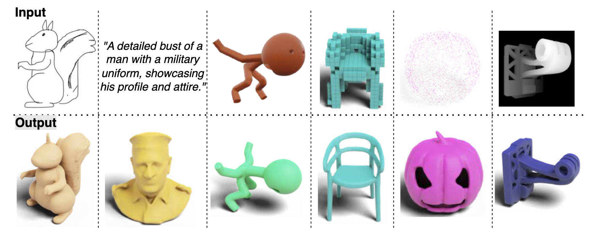

# WAVELET LATENT DIFFUSION (WALA) Optimization
[](https://arxiv.org/pdf/2411.08017)

This is a modified codebase for the optimization of the paper "**WAVELET LATENT DIFFUSION (WALA): BILLION-
PARAMETER 3D GENERATIVE MODEL WITH COM-PACT WAVELET ENCODINGS**"



### [Project Page](https://autodeskailab.github.io/WaLaProject), [arxiv paper](https://arxiv.org/abs/2411.08017), [Models](https://huggingface.co/models?search=ADSKAILab/WaLa), [Demo](https://colab.research.google.com/drive/1W5zPXw9xWNpLTlU5rnq7g3jtIA2BX6aC?usp=sharing)

### Tasks
- [] 
- [] 
- []


## Getting Started

### Installation
- Python >= 3.10
- Install CUDA if available
- Install PyTorch according to your platform: [https://pytorch.org/get-started/locally/](https://pytorch.org/get-started/locally/)
- Install other dependencies by `pip install -r requirements.txt`

For example, on AWS EC2 instances with PyTorch Deep learning AMI, you can setup the environment as follows:
```
conda create -n wala python==3.10
conda activate wala
pip install -r requirements.txt
```

### Inference

For multiple generation use different --seed parameter

### Optimal Parameters for `--scale` and `--diffusion_rescale_timestep`

Based on our extensive grid search on the validation set across different conditions, the optimal parameters are shown below.

| Model              | Scale | Timestep |
|--------------------|-------|----------|
| Voxel              | 1.5   | 5        |
| Pointcloud         | 1.3   | 8        |
| Single-View RGB    | 1.8   | 5        |
| Sketch             | 1.8   | 5        |
| Single-View Depth  | 1.8   | 5        |
| Multi-View RGB     | 1.3   | 5        |
| Multi-View Depth   | 1.3   | 5        |
| 6 Multi-View Depth | 1.5   | 10       |
| Text to 3d         | 1.5   | 10       |
| Unconditional      | -     | 1000     |

*Table: Classifier-free scale and timestep used in the paper*

### Single-View to 3D

<div align="center">
  <!-- Row 1: Images -->
  
  
  
  
  
  
</div>

[](https://huggingface.co/ADSKAILab/WaLa-SV-1B)

The input data for this method is a single-view image of a 3D object.

```sh
python run.py --model_name ADSKAILab/WaLa-SV-1B --images examples/single_view/table.png --output_dir examples --output_format obj --scale 1.8 --diffusion_rescale_timestep 5

```

### Sketch to 3D

<div align="center">
  <!-- Row 1: Images -->
  
  
  
  
  
  
</div>


[](https://huggingface.co/ADSKAILab/WaLa-SK-1B)

The model uses sketch input with detailed geometry and complex structures to generate 3D object.

```sh
python run.py --model_name ADSKAILab/WaLa-SK-1B --sketch examples/sketch/tree.png --output_dir examples --output_format obj --scale 1.8 --diffusion_rescale_timestep 5

``


## Citation
```bibtex
@misc{sanghi2024waveletlatentdiffusionwala,
      title={Wavelet Latent Diffusion (Wala): Billion-Parameter 3D Generative Model with Compact Wavelet Encodings}, 
      author={Aditya Sanghi and Aliasghar Khani and Pradyumna Reddy and Arianna Rampini and Derek Cheung and Kamal Rahimi Malekshan and Kanika Madan and Hooman Shayani},
      year={2024},
      eprint={2411.08017},
      archivePrefix={arXiv},
      primaryClass={cs.CV},
      url={https://arxiv.org/abs/2411.08017}
}

